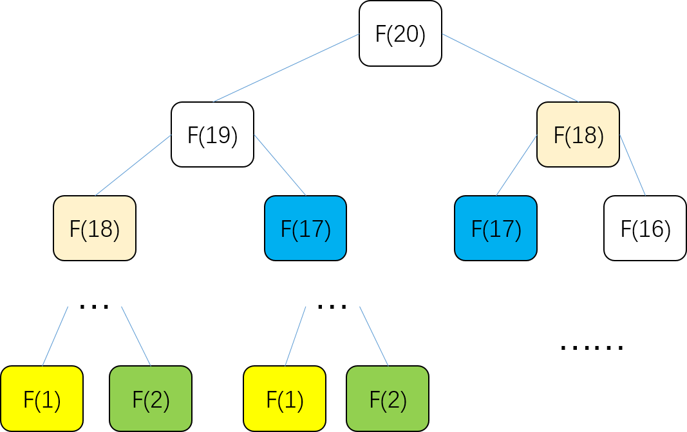
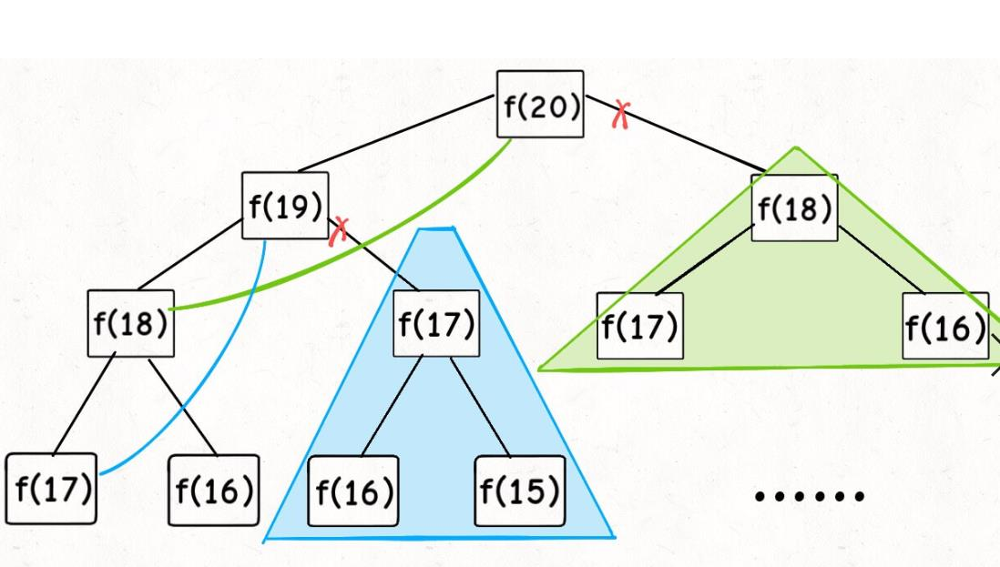

# 动态规划详解

**动态规划换种说法，就是当前结果与前一结果休戚与共**。而与前一结果有关，是不是很容易想到斐波那契数（F(n) = F(n-1) + F(n-2)）？但严格来说斐波那契数并不算动态规划，因为它没有体现**动态**，也就是他的前一结果并不存在**最优性**的选择，但我们能通过结构波那契，来理解背后通用的思想，将更容易打开动态规划的大门。

### 一、斐波那契数列数据

**1、暴力递归**

> 1 1 2 3 5 7 12 ...

我们很早就学过斐波那契数列，也知道随便给定一个数列中的某个数，我们能秒算它的前一个。（前项比后项黄金分割），它数学形式显然可以递归，写成代码就是这样：

```cpp
int fib(int N) {
    if (N == 1 || N == 2) return 1;
    return fib(N - 1) + fib(N - 2);
}
```

这样的代码也简洁易懂，却十分低效，低效在哪里？假设 n = 20，它的递归树如下：



这个递归树很容易理解。就是说要求解问题 `f(20)`，得先计算出它的子问题 `f(19)` 和 `f(18)`，然后想要要计算 `f(19)`，就要先算出子问题 `f(18)` 和 `f(17)`，以此类推。最后直到已知的 `f(1)` 或者 `f(2)` ，递归树就不用向下生长了。

PS：如果遇到递归问题，可以尝试画出递归树，会对分析算法复杂度，寻找算法低效原因都有莫大帮助。

比如这个递归算法的时间复杂度怎么计算？很容易想到的就是**子问题个数乘以解决一个子问题需要的时间。**

子问题个数，即该递归树中节点的总数。显然二叉树节点总数为指数级别`（1+2+4+8+···）`，所以子问题个数为 O(2^n)。而解决单个子问题的时间，在本算法中，只有` f(n - 1) + f(n - 2) `一个加法操作，时间为 `O(1)`。

即这个算法的时间复杂度为 `O(2^n)`，指数级别，**崩溃**。

但观察递归树，我们很明显发现了算法低效的原因：**存在大量重复计算**。比如 `f(18)` 被计算了两次，而且你可以看到，以 `f(18)` 为根的这个递归树体量巨大，多算一遍，会耗费巨大的时间。更何况，还不止 `f(18)` 这一个节点被重复计算，所以这个算法及其低效。

这就暴露了动态规划问题的第一个性质：**重叠子问题**。

**思考**：如何不让子问题重复计算？怎么解决呢？很容易。我们可以用**备忘录**把每次子问题计算的结果都保存下来。这样每次需要计算新的子问题时，先去查询下这个备忘录是否有过记录，如果有，则直接使用，如果没有，则需要重新计算，且更新一下备忘录就行。

**2、带备忘录的递归解法**

根据第一节末尾的思考，我们把递归的代码做了改进，如下所示：

```cpp
int fib(int N) {
    if (N < 1) return 0;
    // 备忘录全初始化为 0
    vector<int> memo(N + 1, 0); // 使用备忘录
    return helper(memo, N);
}
 
int helper(vector<int>& memo, int n) {
    if (n == 1 || n == 2) return 1;   // base case 
    if (memo[n] != 0) return memo[n]; // 备忘录中存在过

    memo[n] = helper(memo, n - 1) + helper(memo, n - 2); //不存在则需要计算，且更新备忘录
    return memo[n];
}
```

画出新的递归树，我们来看看「备忘录」到底做了什么。



