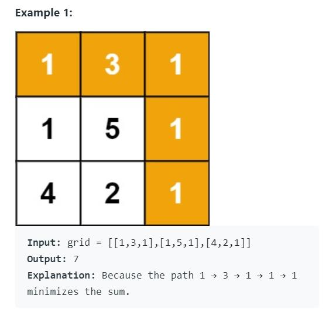

# 最小路径和

从[凑零钱问题](./凑零钱问题.md) 中，我们学到了动态规划得几个要素：1、重复子问题得剪枝；2、状态转移方程得代码化；3、最优子问题得动态性。

最小路径和则正好可以再练习练习。

简单描述就是，首先给定一个都是非负整数的二维数组（m,n），找到一个路径从左上角到右下角，找到一条总和最小的路径，只能往右和往下移动。举例如下：



先分析题目，一看到最小路径，就想到肯定有个优化**动态性**即`min`函数肯定存在，我们再假定我们求解的这个最小路径是一个数组`f[m][n]`  因为原来输入数组的每个值都有一条达到的最小路径。则它的当前值是只能由前面一个值或者上面一个值移动而来。其状态转移方程可以描述为：
$$
f[i][j] = min(f[i-1][j], f[i][j-1]) + base[i][j]
$$
`base[i][j] `则表示数组当前的值。由此，我们也看到了会存在一些重复的子问题，所以动规三要素一个不少。其中最核心的就是思考它的状态转移方程，理清楚他的状态量和移动规律即可。

**暴力递归**

根据之前的经验，我们先写一个暴力递归形式：

```cpp
class Solution {
public:
    int minPathSum(vector<vector<int>>& grid) {
        int m = grid.size();
        int n = grid[0].size();
        return helper(grid, m -1 , n - 1); // 状态只和 m 和 n 有关
    }
private:
    int helper(vector<vector<int>>& grid, int x, int y) {
        if(x <0 || y <0) return INT_MAX;
        if(x == 0 && y==0) return grid[0][0];
        return min(helper(grid, x-1, y), helper(grid, x, y-1)) + grid[x][y];
    }
};
```

很遗憾，简单case没问题，但复杂case就会超时，进阶版，用备忘录法改进。

**带备忘录的递归**

简单说，就是在计算返回值时，查看备忘录demo里是否存在，存在直接用，不存在，则先保存再返回。

```cpp
class Solution {
public:
    int minPathSum(vector<vector<int>>& grid) {
        int m = grid.size();
        int n = grid[0].size();
        this->demo = vector<vector<int>>(m, vector<int>(n, -1));
        return helper(grid, m -1 , n - 1);
    }
private:
    vector<vector<int>> demo;
    
    int helper(vector<vector<int>> &grid, int x, int y) {
        if(x < 0 || y < 0) return INT_MAX;
        if(x == 0 && y== 0) return grid[0][0];
        return min(get_demo(grid,x-1,y), get_demo(grid,x,y-1)) + grid[x][y];
    }
    
    int get_demo(vector<vector<int>> &grid, int x, int y) {
        if(x < 0 || y < 0) return INT_MAX;
        if(demo[x][y] >= 0) return demo[x][y];
        else return demo[x][y] =  helper(grid, x, y);
    }
};
```

好，搞定带备忘录的递归之后，开始考虑怎么自下而上用数组表示。说白了就是通过已知条件，把能计算的矩阵值填满。

**自下而上**


